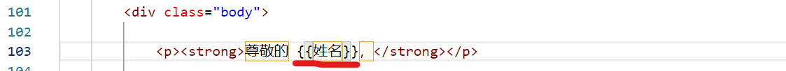
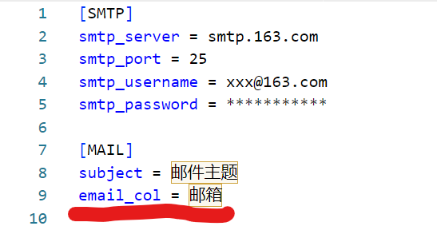

# **exmail**
批量发送个性化邮件给excel文件中的收件人。  

## **准备工作**

1. 如果你还没有安装python，首先请[下载python安装包](https://www.python.org/downloads/)并安装。
2. 安装必要的python包  

        pip install -r requirements.txt  
   

3. 定制邮件模板email_template.html。在需要的地方输入要替换的变量。变量格式为 {{变量名称}}。  

    比如，如果模板文件里有一个变量 {{姓名}}，程序执行的时候会使用Excel里“姓名”这一列的值替换模板中的 {{姓名}} 这几个字符。  

    
  

4. 修改config.ini中的邮件服务器等配置信息。  

  

    注意：
    - 把其中 email_col的值改成excel文件中存放电子邮件地址这一列的列名。在上面的例子中，列名是“邮箱”。
    - 使用网易邮箱时，需要开通POP3/SMTP权限，并用开通权限后获得的token字符串作为smtp_password参数的值。
  

## **发送邮件**

执行程序：   

    python app.py [--temp_file TEMP_FILE] excel_file 
  
其中：  
- excel_file 是存放收件人信息的excel文件。  
- TEMP_FILE 是邮件模板文件的名称，缺省是email_template.html。
  

## **检查并处理发送结果**
程序执行完成之后会生成一个results.xlsx文件。此文件内容与输入的excel文件一致，只是增加了一列“邮件已发送”。这一列的值为“Y”表示该收件人的邮件已经成功发送，值为“N”表示还没有发送/发送不成功。  
  
使用下列命令可以继续发送邮件，其中“邮件已发送”列的值为“Y”的行会跳过，实现断点重发的效果。
  
    python app.py --temp_file email_template.html results.xlsx 